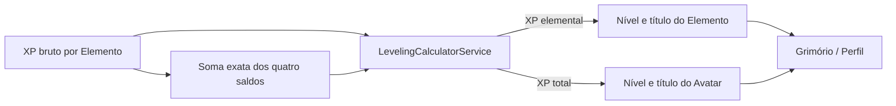
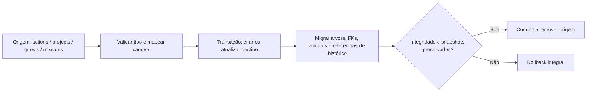

# Diagramas e Fluxos da Plataforma

Diagramas de referência para arquitetura de dados, hierarquia, pontuação e navegação. As regras normativas ficam nos documentos de domínio e plataforma vinculados em cada seção.

## Diagrama de Arquitetura de Dados

IDs de tabelas de domínio e FKs são UUID v4 textuais. `element_code` e `area_code` são códigos semânticos estáveis, não IDs.

```
┌─────────────────────────────────────────────────────────────────────────────┐
│                           CONSELHO ELEMENTAL                                 │
│                     Arquitetura de Dados - System Model                      │
└─────────────────────────────────────────────────────────────────────────────┘

┌─────────────────────────────────────────────────────────────────────────────┐
│                              ENTIDADES PRINCIPAIS                            │
└─────────────────────────────────────────────────────────────────────────────┘

┌──────────────┐     ┌──────────────┐     ┌─────────────────────────┐
│   ELEMENTS   │     │    AREAS     │     │         ACTIONS         │
├──────────────┤     ├──────────────┤     ├─────────────────────────┤
│ id: UUID v4  │────▶│ id: UUID v4  │◀────│ id: UUID v4             │
│ element_code │     │ area_code    │     │ parent_id: UUID/null    │
│ name         │     │ element_id   │     │ lifecycle_type (raiz)   │
│ color        │     │ parent_id    │     │ semantic_type (filhos)  │
│ icon         │     │ color_hex    │     │ project/quest/mission FK│
└──────────────┘     └──────────────┘     │ due_date/recurrence     │
                                          │ base/effort/area        │
                                          └─────────────────────────┘
                                                     ▲
                                                     │ self-FK parent_id
                                                     └── filhos/netos/bisnetos

┌────────────────────┐  ┌────────────────────┐  ┌────────────────────┐
│     PROJECTS       │  │       QUESTS       │  │      MISSIONS      │
├────────────────────┤  ├────────────────────┤  ├────────────────────┤
│ id: UUID v4        │  │ id: UUID v4        │  │ id: UUID v4        │
│ prazo, escopo      │  │ lore, badges       │  │ propósito          │
└────────────────────┘  └────────────────────┘  └────────────────────┘

┌───────────────────────┐      ┌───────────────────────────────┐
│   HABIT_ROTATIONS     │      │      ROTATION_MEMBERSHIPS      │
├───────────────────────┤      ├───────────────────────────────┤
│ id: UUID v4           │◀─────│ rotation_id: UUID v4          │
│ current_position      │      │ habit_id: UUID v4             │
│ last_resolved_date    │      │ position (ordinal, não ID)    │
└───────────────────────┘      └───────────────────────────────┘

┌─────────────────────────────────────────────────────────────────────────────┐
│                              HIERARQUIA DE TIPOS                             │
└─────────────────────────────────────────────────────────────────────────────┘

┌─────────────────────────────────────────────────────────────────────────────┐
│  PROJECT / MISSION (tabelas macro próprias)                                 │
│  ├── ACTION (`actions`, lifecycle_type='ACTION')                            │
│  ├── HABIT (`actions`, lifecycle_type='HABIT')                              │
│  └── QUEST (`quests`; associa Actions por FK/junção)                         │
│                                                                              │
│  ACTION/HABIT ROOT (`parent_id=null`, lifecycle_type; semantic_type=null)    │
│  └── ACTION DESCENDANT (`parent_id` UUID v4; lifecycle_type=null)            │
│      ├── VALUABLE  - pode gerar XP/base_value                                │
│      ├── VALUELESS - marcação visual, sem XP                                 │
│      └── NOTE      - texto informativo, sem checkbox                         │
│          └── mesmos tipos podem continuar em profundidade ilimitada           │
│                                                                              │
│  RASCUNHO (Inbox/Forja) - só título; tipo e área nulos                       │
└─────────────────────────────────────────────────────────────────────────────┘

┌─────────────────────────────────────────────────────────────────────────────┐
│                         REGRA DE AGREGAÇÃO (LEAF vs AGGREGATOR)             │
└─────────────────────────────────────────────────────────────────────────────┘

    LEAF (Sem descendente VALUABLE)            AGGREGATOR (Com descendente VALUABLE)
    ┌─────────────────────┐                   ┌─────────────────────┐
    │ ✓ usa base_value    │                   │ ignora base da raiz │
    │ ✓ esforço da folha  │                   │ soma folhas elegíveis│
    │ ✓ pode pontuar      │                   │ esforço/Prana da raiz│
    │                     │                   │                     │
    │ Pontuação própria   │                   │ Soma dos filhos     │
    └─────────────────────┘                   └─────────────────────┘
              │                                          ▲
              │ Adiciona primeiro filho Task             │
              └──────────────────────────────────────────┘

┌─────────────────────────────────────────────────────────────────────────────┐
│                              FÓRMULA DE PONTUAÇÃO                            │
└─────────────────────────────────────────────────────────────────────────────┘

    ┌─────────────────────────────────────────────────────────────────────┐
    │  VALOR PLANEJADO (Planned Value)                                    │
    │                                                                     │
    │  projected_leaf = MIN(base × (1+presence) × effort × time, cap)     │
    │                                                                     │
    │  ┌────────────┐ ┌─────────────┐ ┌─────────────┐ ┌─────────────────┐│
    │  │   base     │ │  presence   │ │   effort    │ │      time       ││
    │  │ default: 1 │ │ +0.0 a +0.5 │ │ ×1.0 a ×2.8 │ │  ×1.0 a ×4.0    ││
    │  │ (aceita    │ │             │ │             │ │  Escalonamento  ││
    │  │ decimais)  │ │             │ │             │ │  Agressivo:     ││
    │  │            │ │             │ │             │ │  > 120m = ×4.0  ││
    │  └────────────┘ └─────────────┘ └─────────────┘ └─────────────────┘│
    └─────────────────────────────────────────────────────────────────────┘

    ┌─────────────────────────────────────────────────────────────────────┐
    │  PRANA (Energia) — recurso global do usuário                        │
    │                                                                     │
    │  Custo por effort_level:   1=-5   2=-10   3=-15   4=-25   5=-35     │
    │  Restaurador (Sono/Meditação): recupera Prana em vez de custar     │
    │  Veneno: custa Prana normalmente, mas gera 0 pontos elementais      │
    │  Teto por esforço: 10, 25, 50, 100 ou 200 pontos/folha              │
    └─────────────────────────────────────────────────────────────────────┘

    ┌─────────────────────────────────────────────────────────────────────┐
    │  DISTRIBUIÇÃO POR ÁREA (Multi-Area)                                 │
    │                                                                     │
    │  Orçamento distribuído: 100% do valor limitado da folha             │
    │                                                                     │
    │  ┌─────────────────────────────────────────────────────────────┐   │
    │  │  1 área: 100% Primária                                     │   │
    │  │  2 áreas: 70% Primária / 30% Secundária                    │   │
    │  │  3 áreas: 60% Primária / 25% Secundária / 15% Terciária    │   │
    │  └─────────────────────────────────────────────────────────────┘   │
    │                                                                     │
    │  Total alocado entre áreas: 100% do final_value                   │
    └─────────────────────────────────────────────────────────────────────┘

┌─────────────────────────────────────────────────────────────────────────────┐
│                              FLUXO DE DADOS                                  │
└─────────────────────────────────────────────────────────────────────────────┘

```
    ┌─────────────────────┐       ┌──────────────────────────────┐
    │ Criar em tela       │       │ Criar Rascunho no Inbox      │
    │ contextual          │       │ apenas com título            │
    └──────────┬──────────┘       └──────────────┬───────────────┘
               │                                  ▼
               │                    ┌──────────────────────────────┐
               │                    │ Classificar via Quick Edit   │
               │                    │ ou Wizard de Triagem         │
               │                    └──────────────┬───────────────┘
               └──────────────────┬───────────────┘
                                  ▼
                         ┌───────────────────────┐
                         │ Entidade tipada       │
                         │ área real ou          │
                         │ area-sem-categoria    │
                         └──────────┬────────────┘
                                    ▼
                         ┌───────────────────────┐
                         │ Planejar e executar   │
                         └───────────────────────┘
    └─────────────┘     └─────────────┘     └─────────────┘     └─────────────┘
                                                                        │
                                                                        ▼
                                                               ┌─────────────────────────┐
                                                               │ EXECUTION LOG           │
                                                               │ Imutável enquanto existe│
                                                               │ Undo = Hard Delete      │
                                                               └─────────────────────────┘

┌─────────────────────────────────────────────────────────────────────────────┐
│                              TELAS DO SISTEMA                                │
└─────────────────────────────────────────────────────────────────────────────┘

┌─────────────────────────────────────────────────────────────────────────────┐
│  🏠 SANTUÁRIO (Dashboard)                                                   │
│  ├── Equilíbrio dos 4 Elementos (Radar/Gráfico)                            │
│  ├── Cards de Elementos com pontuação                                      │
│  ├── Domínios Superiores (Áreas principais)                                │
│  └── Acesso rápido a rituais do dia                                        │
├─────────────────────────────────────────────────────────────────────────────┤
│  📜 RITUAIS (Tarefas)                                                       │
│  ├── Lista de tarefas pendentes                                            │
│  ├── Filtros por área/elemento                                             │
│  ├── Cronômetro de execução                                                │
│  └── Visualização hierárquica (TreeView)                                   │
├─────────────────────────────────────────────────────────────────────────────┤
│  🔄 CICLOS (Hábitos)                                                        │
│  ├── Visão: Dia / Semana / Mês / Trimestre / Ano                          │
│  ├── Calendário de ciclos concluídos                                       │
│  ├── Marcos de consistência                                                │
│  └── Frequência e evolução                                                 │
├─────────────────────────────────────────────────────────────────────────────┤
│  🗺️ JORNADAS (Quests)                                                       │
│  ├── Quests ativas                                                         │
│  ├── Progresso por quest                                                   │
│  ├── Tarefas vinculadas                                                    │
│  └── Recompensas                                                           │
├─────────────────────────────────────────────────────────────────────────────┤
│  🏗️ GRANDES OBRAS (Projetos)                                                │
│  ├── Lista de projetos                                                     │
│  ├── Campanhas (missões) por projeto                                       │
│  ├── Progresso agregado                                                    │
│  └── Timeline                                                              │
├─────────────────────────────────────────────────────────────────────────────┤
│  🔨 FORJA (Rascunhos)                                                       │
│  ├── Itens não classificados                                               │
│  ├── Questionário de triagem                                               │
│  └── Sugestão de tipo (Action/Habit/Project/Quest/Mission)                 │
├─────────────────────────────────────────────────────────────────────────────┤
│  🔮 ASTROLÁBIO (Analytics)                                                  │
│  ├── Evolução por elemento (gráfico de linha)                              │
│  ├── Evolução por área                                                     │
│  ├── Distribuição percentual (gráfico de pizza)                            │
│  ├── Ciclos concluídos e heatmap                                           │
│  └── Linha do tempo elemental                                              │
├─────────────────────────────────────────────────────────────────────────────┤
│  📖 GRIMÓRIO (Perfil)                                                       │
│  ├── Avatar do mago                                                        │
│  ├── Nível/Título geral do Avatar (XP bruto total dos 4 Elementos)         │
│  ├── Nível/Título individual de Terra, Fogo, Água e Ar                     │
│  ├── XP atual e barra para o próximo nível (sem level cap)                 │
│  ├── Marcos de consistência                                                │
│  ├── Estatísticas gerais                                                   │
│  └── Histórico visual                                                      │
├─────────────────────────────────────────────────────────────────────────────┤
│  ➕ CRIAÇÃO CONTEXTUAL (Ciclos/Tarefas/Quests/Projetos)                     │
│  ├── Entidade nasce no tipo da tela                                        │
│  ├── Área inicial: area-sem-categoria quando ainda não definida             │
│  ├── Inbox de Rascunhos: criação exclusiva com título                       │
│  └── Classificação do Rascunho: Quick Edit ou Wizard                        │
│  ├── Nível de esforço                                                      │
│  └── Tempo estimado                                                        │
└─────────────────────────────────────────────────────────────────────────────┘

## Referência de apresentação

Os códigos de cores elementais são definidos em [Glossário](../00-Overview/Glossario.md). Tokens de UI, acessibilidade e requisitos dos fluxos nativos estão em [Princípios de UX e Fluxos](./07-Principios-de-UX-e-Fluxos.md); este diagrama não define paleta, tipografia ou animações paralelas.

┌─────────────────────────────────────────────────────────────────────────────┐
│                              COMPONENTES REUTILIZÁVEIS                       │
└─────────────────────────────────────────────────────────────────────────────┘

    ┌─────────────────┐  ┌─────────────────┐  ┌─────────────────┐
    │  ElementCard    │  │   TaskCard      │  │   AreaBadge     │
    │  ─────────────  │  │  ────────────   │  │  ────────────   │
    │  🔥 Fogo        │  │  ☐ Tarefa       │  │  45 Saúde       │
    │  Ação & Projetos│  │  🌿 Saúde       │  │  +27 Criatividade│
    │  [=======68%]   │  │  ⏱️ 30 min      │  │                 │
    │  1,250 pts      │  │  [Iniciar]      │  │  (com valor!)   │
    └─────────────────┘  └─────────────────┘  └─────────────────┘

    ┌─────────────────┐  ┌─────────────────┐  ┌─────────────────┐
    │  ExecutionTimer │  │  TreeView       │  │  ElementRadar   │
    │  ─────────────  │  │  ────────────   │  │  ────────────   │
    │  ⏱️ 15:32       │  │  ▼ Tarefa       │  │      🔥         │
    │  [Registrar tempo] │  │    ├─ ☐ Item 1  │  │    🌿    💨     │
    │  [Concluir]     │  │    └─ ☐ Item 2  │  │      🌊         │
    └─────────────────┘  └─────────────────┘  └─────────────────┘

┌─────────────────────────────────────────────────────────────────────────────┐
│                              FLUXOS PRINCIPAIS                               │
└─────────────────────────────────────────────────────────────────────────────┘

    ┌─────────────────────────────────────────────────────────────────────┐
    │  FLUXO: Criar e Executar uma Tarefa/Ação                             │
    │                                                                     │
    │  1. Criar na tela Tarefas → Action (lifecycle_type='ACTION')      │
    │  2. Preencher: título, área, esforço, tempo                         │
    │  3. Salvar → aparece na lista                                       │
    │  4. Iniciar → cronômetro começa                                     │
    │  5. Executar → pausar/continuar conforme necessário                 │
    │  6. Concluir → tempo salvo, pontuação calculada                     │
    │  7. Feedback → pontos ganhos, progresso na área/elemento            │
    └─────────────────────────────────────────────────────────────────────┘

    ┌─────────────────────────────────────────────────────────────────────┐
    │  FLUXO: Triagem na Forja (Rascunho → Classificado)                  │
    │                                                                     │
    │  1. Criar na Forja → apenas título                                  │
    │  2. Classificar → Quick Edit ou Wizard                              │
    │  3. Escolher qualquer entidade do sistema:                          │
    │     Action, Habit, Project, Quest ou Mission                         │
    │  4. Atribuir campos obrigatórios da entidade de destino               │
    │  5. Confirmar → INSERT na tabela canônica correspondente              │
    └─────────────────────────────────────────────────────────────────────┘

    ┌─────────────────────────────────────────────────────────────────────┐
    │  FLUXO: Onboarding do Mago                                          │
    │                                                                     │
    │  1. Boas-vindas ao Conselho Elemental                               │
    │  2. Escolha do avatar                                               │
    │  3. Apresentação dos 4 elementos                                    │
    │  4. Seleção de áreas iniciais (mínimo 1 por elemento)               │
    │  5. Primeira invocação (criar Tarefa ou Ciclo)                      │
    │  6. Santuário inicial com áreas selecionadas                        │
    └─────────────────────────────────────────────────────────────────────┘

## Progressão Elemental e Grimório



A projeção é infinita, e o bracket de nível 200 ou superior exibe o título **Lenda**. Fórmula, faixas e contrato do serviço estão em [Motor de Pontuação e Energia](../01-Domain-Core/02-Motor-de-Pontuacao-e-Energia.md#10-progressão-infinita-e-cálculo-de-níveis) e [Grimório e Perfil](./05-Grimorio-e-Perfil.md).

## Conversão de Entidade após Criação



Action ↔ Habit conserva a linha `actions`; conversões entre tabelas criam o destino apropriado e preservam UUIDs/valores históricos conforme o Data Migration Service definido em [01-Hierarquia-e-Tipos.md](../01-Domain-Core/01-Hierarquia-e-Tipos.md#4-conversão-de-entidades-data-migration-service).
